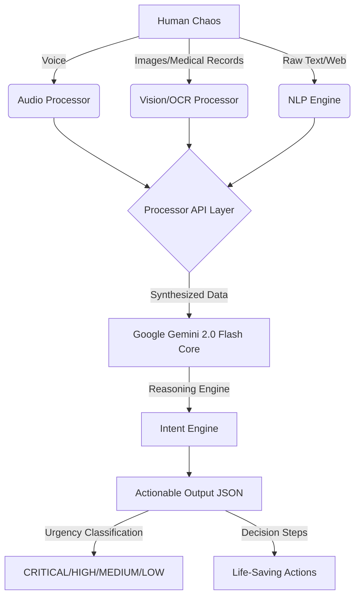

# 🌉 Universal AI Bridge

> **From Chaos to Clarity, Instantly.**
> A Universal AI system that acts as an intelligent bridge between chaotic, unstructured human intent (images, text, voice, news) and complex systems, generating structured, life-saving actions.

## 🏆 Project Architecture

The Universal AI Bridge utilizes a multi-modal input processing layer that handles any chaotic input type. The inputs are pre-processed using NLP and OCR engines (like spaCy and Tesseract) before being synthetically passed into **Google Gemini 2.0 Agent Builder** to structure the output and recommend critical actions.



## 🚀 How to Test This Locally

1. **Install Dependencies**
   ```bash
   pip install -r requirements.txt
   ```
2. **Add Your Gemini API Key**
   Create a `.env` file in the `backend/` directory and add your key:
   ```env
   GOOGLE_API_KEY=YOUR_API_KEY
   ```
3. **Start the Agent UI (Streamlit)**
   ```bash
   streamlit run streamlit_app.py
   ```
4. **Test the Application**
   - Open your browser to `http://localhost:8501`.
   - **Upload Multiple Images:** Go to the 🖼️ Image tab, highlight 5-10 images (or a stack of medical records), and drop them in. The agent will bulk-process every single record.
   - **Test Chaotic Text:** Go to the 📝 Text Tab and paste a messy prompt like: *"There is a massive accident near the Whitefield junction, two lanes are totally blocked."*
   
## 🔒 Secured Cloud Deployment (Google Cloud Run)
This repository contains a highly optimized, completely serverless `Dockerfile` ready for deployment to **Google Cloud Run**.

By default, we are deploying this application to a **Private secured network**. This means the URL generated will NOT be accessible to the public internet, keeping your sensitive AI data and API keys highly secure. Only authenticated identities from your Google Cloud Identity and Access Management (IAM) controls will be able to access the environment!

To deploy on Google Cloud Shell securely:
```bash
git pull origin main
gcloud run deploy uade-ai --source . --region asia-south1 --no-allow-unauthenticated --set-env-vars GOOGLE_API_KEY="your-api-key"
```
*(The `--no-allow-unauthenticated` flag guarantees the application securely drops any unauthenticated traffic from the internet).*